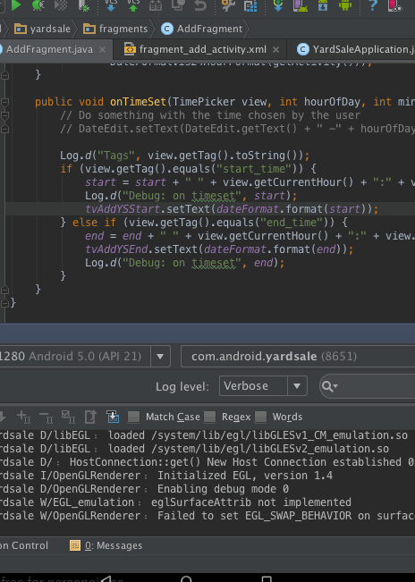

*YardSale*

**YardSale** is an android app that allows users to discover location centric yard sales.

## Sprint 3

Here's a walkthrough of implemented user stories:

GIF created with [LiceCap](http://www.cockos.com/licecap/).

## Sprint 2

* [x] User can register and login to the app
* [x] User can view the yard sale in list view and map view
* [x] User can view details for items in the yard sale
* [x] Users can search for a specific item 
* [x] User can host a yard sale, including the following items
	* [x] pictures of the sale items
	* [x] time, date, location
	* [x] title, description 
* [x] User can edit yard sale if it belongs to him - add/remove pictures, change time, date, location, title, description
* [x] User can delete a yard sale if it belongs to him
* [x] User can edit/delete items in a yard sale if it belongs to him - description, price
* [x] Users can share the yard sale information to friends
* [x] Save/bookmark a yard sale to visit in future

Here's a walkthrough of implemented user stories:

GIF created with [LiceCap](http://www.cockos.com/licecap/).

## Sprint 1

* [x] User can register and login to the app
* [x] User can view the yard sale in list view and map view
* [x] User can view details for items in the yard sale
* [x] Users can search for a specific item 

## Video Walkthrough 
Here's a walkthrough of implemented user stories:

GIF created with [LiceCap](http://www.cockos.com/licecap/).

## User Stories

The following **required** functionality is completed:

* [ ] User can **login/register** to the app
* [ ] User can host a yard sale, including the following items
	* [ ] pictures of the sale items
	* [ ] time, date, location
	* [ ] title, description 
* [ ] User can view the yard sale in map/list view
* [ ] User can view details for items in the yard sale
* [ ] User can edit yard sale if it belongs to him - add/remove pictures, change time, date, location, title, description
* [ ] User can delete a yard sale if it belongs to him
* [ ] User can edit/delete items in a yard sale if it belongs to him - description, price
* [ ] Users can share the yard sale information to friends
* [ ] Users can search for a specific item 

The following **optional** features are implemented:

* [ ] push notifications for favorited yard sales and/or for new yard sales in your home location
* [ ] view his own profile and edit it
* [ ] save/bookmark a yard sale to visit in future 
* [ ] advanced filters to search yard sale 
* [ ] users can view history of users activity
* [ ] users can route to the selected yard sale

## Notes

Describe any challenges encountered while building the app.

## Open-source libraries used

- [Android Async HTTP](https://github.com/loopj/android-async-http) - Simple asynchronous HTTP requests with JSON parsing
- [Picasso](http://square.github.io/picasso/) - Image loading and caching library for Android

## License

    Copyright [yyyy] [name of copyright owner]

    Licensed under the Apache License, Version 2.0 (the "License");
    you may not use this file except in compliance with the License.
    You may obtain a copy of the License at

        http://www.apache.org/licenses/LICENSE-2.0

    Unless required by applicable law or agreed to in writing, software
    distributed under the License is distributed on an "AS IS" BASIS,
    WITHOUT WARRANTIES OR CONDITIONS OF ANY KIND, either express or implied.
    See the License for the specific language governing permissions and
    limitations under the License.
